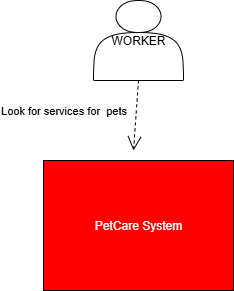
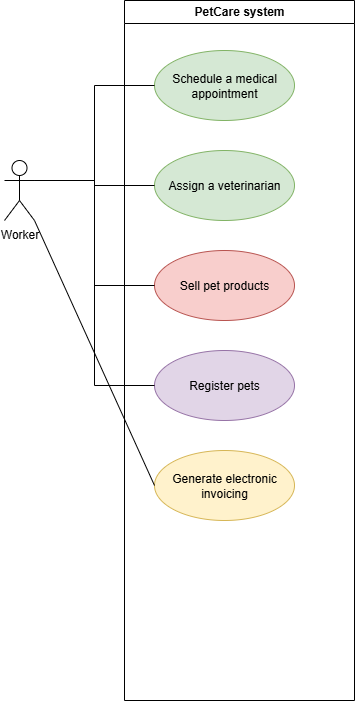

# PetCare360  

**Integrantes:**  
- Néstor David López Castañeda  

---

## Punto 1. Estrategia de ramas GitFlow  

Para la gestión del flujo de trabajo con Git se utilizará **GitFlow**.  

- Se parte de la rama principal: `main`.  
- Se crea una rama de desarrollo base: `feature`.  
- Por cada funcionalidad se crearán ramas con la convención:  
---
**Diagramas**
- ## Diagrama de contexto

- ## Diagrama de casos de uso.

**Descripcion funcionalidades**
1. Como trabajador quiero registrar las macotas de los clientes con sus caracteristicas para poder tener buen manejo y registro de las mascotas que son llevadas.
2. Como trabajador quiero poder agendar citas medicas y asignar los veterinarios para poder tener un control de los horarios de la veterinaria y no tener inconvenientes al momento de ver las citas medicas.
3. Como trabajador quiero poder vender productos de cuidado animal para poder diversificar las ganancias de nuestra veterinaria.
4. Como trabajador quiero generar facturacion electrica para poder tener un mejor registro de lo vendido. Manteniendo asi un mejor control de el flujo de ventas.
- ## Diagrama de clases
.png)
Para los patrones aun no he definido todos, quiero implementar mas pero aun no estoy seguro de que patrones puedo implementar. Por ahora decidi aplicar builder ya que considero que las mascotas pueden tener diferentes datos y no es obligatorio que tengan todo.